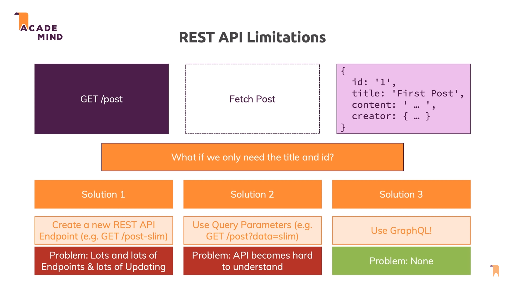
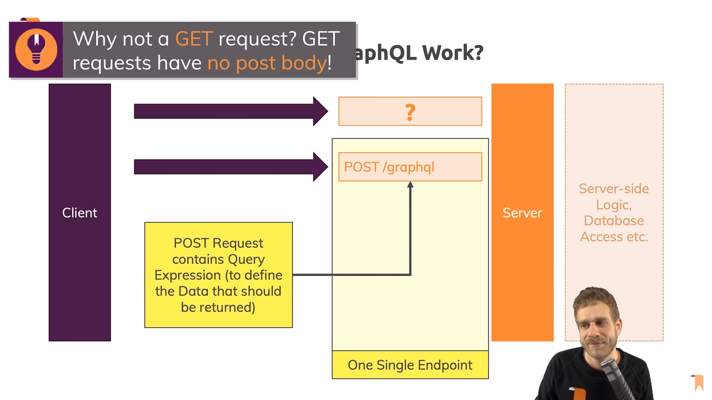
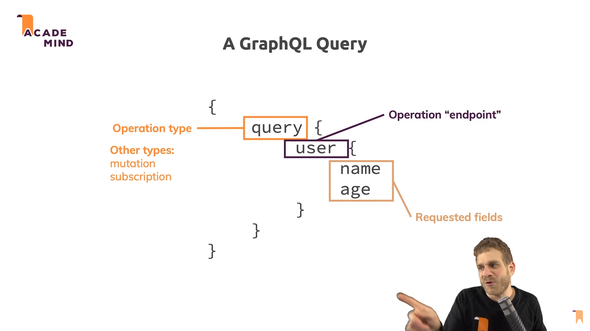
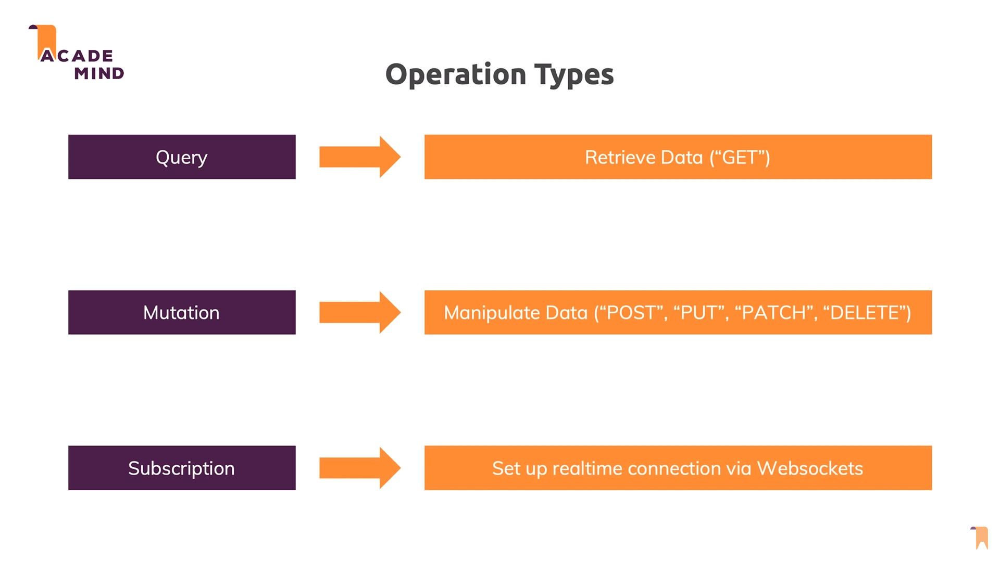
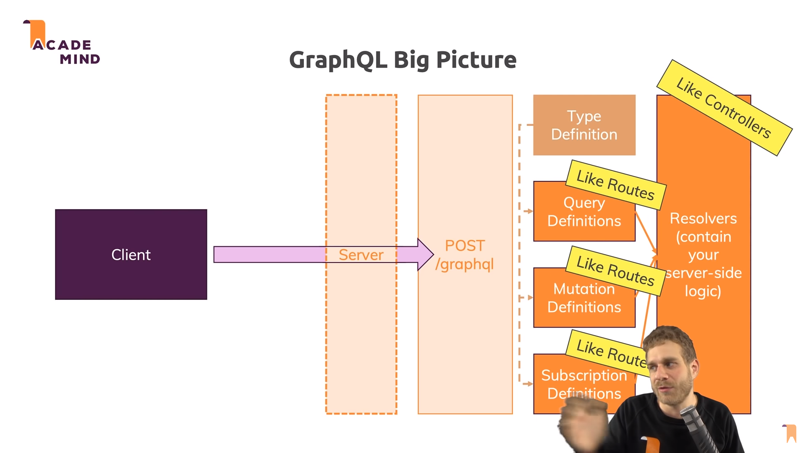
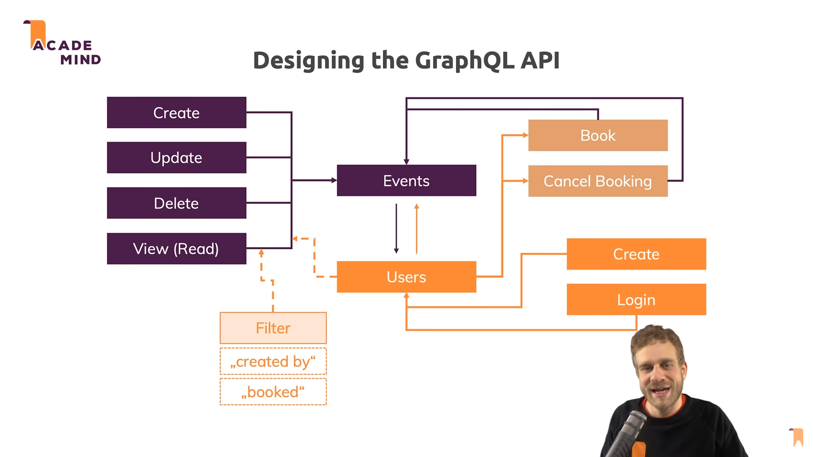
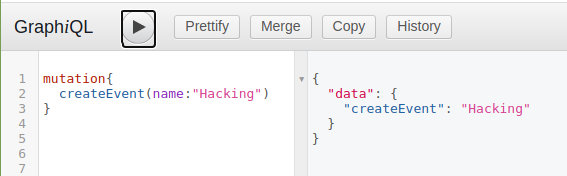
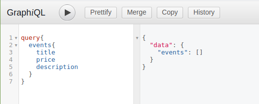
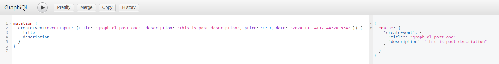
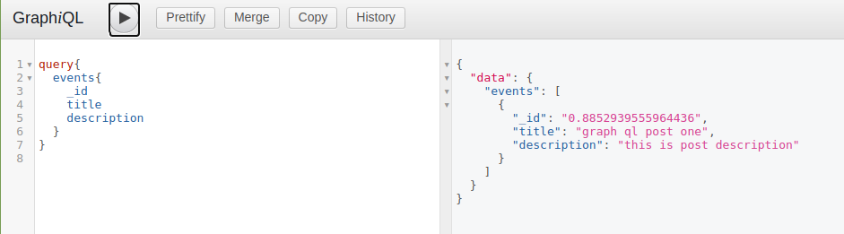

# MERN Stack GraphQL Event Booking API

 - [Tutorial](https://www.youtube.com/watch?v=7giZGFDGnkc&list=PL55RiY5tL51rG1x02Yyj93iypUuHYXcB_)

 - In Graph ql we always need to send post request (there is no get request)

 

 

 

 

 

 

 - Go go __http://localhost:3000/graphql__ and make those query and mutation

 

 

 - Query for particular data

 

 - Add an event and return that event (mutation)

 

 - Query recent created event

 

 - Creating first event and save to database

 ```
 mutation {
  createEvent(eventInput: {title: "graph ql post one", description: "this is post description", price: 9.99, date: "2020-11-14T17:44:26.334Z"}) {
    title
    description
  }
}
 ```

 - Query data from database

 ```
 query{
  events{
    title
    _id
  }
}
 ```

 - Mutation for creating user

 ```
 mutation{
  createUser(userInput:{email:"mbappe@test.com", password:"1234"}){
    email
    password
  }
}
 ```

 - Mutation  for user - creating events with relation of user

 ```
 mutation{
  createEvent(eventInput: {title: "testing created event", description:"this is a test", price: 255, date:"2020-11-15T08:38:47.198Z" }){
    title
    description
  }
}
 ```


